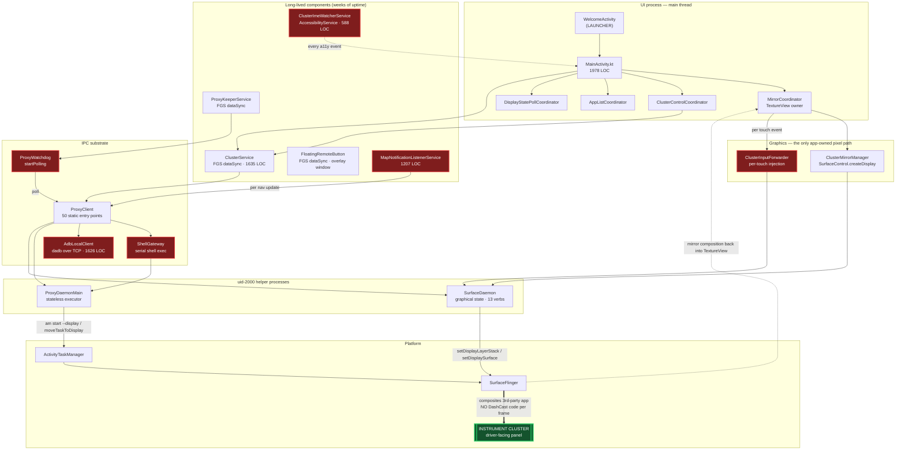

# DashCast — Performance Architecture Map

**Audit date:** 2026-08-23 · **Branch:** `audit/integr-1828` · **Head:** `7aa64f25` (1.8.38-beta / build 628)
**Scope:** `app/` — 184 Kotlin/Java sources, 48 031 LOC, 17 layouts, 330-line manifest.
**Method:** Graphify knowledge graph (`graphify-out/graph.json`, refreshed AST-only this session) + targeted source reads. Every claim below carries a `file:line`.

---

## 0. The single most important finding of Phase 1

> **DashCast has no frame pipeline.**
>
> It does not capture, encode, scale, colour-convert or stream a single pixel to the instrument
> cluster. Projection is achieved by **relocating a third-party application's task onto the OEM
> cluster display** and then letting SurfaceFlinger and that application do 100 % of the per-frame
> work. DashCast's per-frame contribution to the cluster image is **zero**.

This is verified, not assumed:

| Symbol searched across `app/src/main/java` | Result |
|---|---|
| `MediaCodec`, `MediaMuxer`, `MediaRecorder`, `MediaFormat` | **absent** |
| `MediaProjection` | **absent** |
| `ImageReader` | present — **and it is HOT, not cold. See the correction in §0.1.** [SurfaceDaemon.java:650](../../app/src/main/java/com/byd/dashcast/proxy/daemon/SurfaceDaemon.java#L650) |
| `SurfaceControl` | present, but used for **display-token composition**, not readback — [ClusterMirrorManager.kt:24-30](../../app/src/main/java/com/byd/dashcast/cluster/mirror/ClusterMirrorManager.kt#L24-L30) |
| `Choreographer`, `onDraw`, custom `View` render loop | **absent from every projection path** |

### 0.1 CORRECTION — one sub-clause of the claim above was refuted

Lane D was tasked adversarially against §0 and **partially refuted it**. The architectural core
holds; one load-bearing sub-clause did not. Recorded here rather than quietly amended.

**What was wrong:** the assertion that `ImageReader` "appears only in the bug-report screenshot path,
which is not a hot path." It is on a hot path, it is **enabled by default**, and it runs with **no bug
report in progress**:

```
ProxyKeeperService.java:56   HEARTBEAT_MS = 10_000
ProxyKeeperService.java:160  → ClusterShotRecorder.maybeCapture() on every heartbeat
ClusterShotRecorder.kt:52    INTERVAL_MS = 15_000
ClusterShotRecorder.kt:72    getBoolean(PREF_ENABLED, true)      ← DEFAULT ON
ClusterShotSchedulePolicy.kt:4-5   gate = "a cluster projection is active"
                             ⇒ effective cadence ≈ 20 s (15 s threshold sampled on a 10 s heartbeat)
```

Each round captures **two** full-resolution displays, and each capture is a complete
`SurfaceControl.createDisplay` → `ImageReader` → `Bitmap` → **JPEG encode** → disk → `destroyDisplay`
cycle inside the uid-2000 daemon ([SurfaceDaemon.java:650-719](../../app/src/main/java/com/byd/dashcast/proxy/daemon/SurfaceDaemon.java#L650-L719)).

**So the accurate statement is:** DashCast performs **no per-frame work**, but it does perform
**periodic full-screen readback and still-image encode while projecting** — roughly 4 320 captures and
8 640 JPEG encodes per day of driving. That is a still-image telemetry path, not a frame pipeline,
but it is emphatically not cold.

**What survived the refutation, verified exhaustively:** no `MediaCodec`, `MediaMuxer`,
`MediaRecorder`, `MediaProjection`, `MediaFormat`, `PixelCopy`, `GLES`, `EGL`, `RenderScript`,
`HardwareBuffer`, `lockCanvas`, `ServerSocket`, `DatagramSocket` or `LocalSocket` anywhere in
`app/src/main/**`; zero media/codec dependencies in `app/build.gradle:1709-1740`; `dadb` never pulls a
framebuffer ([AdbLocalClient.java:1525](../../app/src/main/java/com/byd/dashcast/infrastructure/AdbLocalClient.java#L1525) documents the removal of the old screencap preview).
**There is no video encode, no frame streaming and no per-frame readback.**

**Consequences for this audit, stated up front:**

1. **Lane D's classical scope does not apply.** There is no encoder to tune — no low-latency flag,
   no bitrate mode, no I-frame interval, no Surface-vs-ByteBuffer copy. (Lane D was therefore
   re-tasked as an adversarial falsification lane against the claim above.)
2. **"Frame time on the cluster" is not primarily DashCast's number.** It belongs to the projected
   app and to SurfaceFlinger. DashCast can only *degrade* it — by stealing CPU, by thrashing the
   GPU with a redundant composition, or by keeping the SoC hot.
3. **The real cost centres are IPC, polling, the main thread, allocation churn and cold start.**
   That is where the audit's weight goes.
4. Architecturally this is a **strength worth recording**: zero encode latency, zero encode power,
   and no codec contribution to glass-to-glass delay. Most "cast to a second display" apps pay all
   three. DashCast does not.

---

## 1. What actually happens, end to end

### 1.1 The projection path (the product)

```
user taps an app
      │
      ▼
MainActivity / ClusterControlCoordinator
      │
      ▼
ClusterService.launchOnDashboard(pkg, callback)          ClusterService.java:809
      │
      ├─ isProjectionAllowed(pkg)                        ClusterService.java:785
      ├─ resolve cluster displayId                       DashboardDisplayHelper / DaemonDisplayEnumerator
      │
      ▼
DashboardLauncher                                        cluster/display/DashboardLauncher.kt:24
      │
      ├── path A: in-process  ── ActivityOptions.setLaunchDisplayId  (denied on DL5.1 / DL4)
      │
      └── path B: uid-2000 daemon (the working path)
              │
              ▼
        ProxyClient  (50 public static entry points)      proxy/ProxyClient.java
              │
              ├── ProxyDaemonMain   — stateless executor: shell + one-shot verbs
              │        └─ `am start --display <id>` / moveTaskToDisplay / resizeTask
              │
              └── SurfaceDaemon     — holds graphical state: display tokens, slot overlays,
                                       trusted VirtualDisplays  (13 TRANSACT codes)
      │
      ▼
ActivityTaskManager relocates the task
      │
      ▼
SurfaceFlinger composites the third-party app onto the cluster layerStack
      │
      ▼
ClusterService.enforceTaskOnDisplay(pkg, displayId)       ClusterService.java:592
   (a corrective loop — the OEM re-fronts its own map, see docs/incidents)
```

**Per-frame call paths owned by DashCast in this diagram: none.** Everything DashCast does here is
*episodic* — on user action, on display connect/disconnect, or on a watchdog tick.

### 1.2 The preview-mirror path (an in-app widget, not the product)

The one place DashCast touches graphics. It mirrors the cluster **back into the head-unit UI** so the
driver can see what is on the cluster.

```
SurfaceControl.createDisplay("mybyd_preview_mirror", secure=false)
  → Transaction.setDisplayLayerStack(token, clusterLayerStack)   ← mirrors cluster content
  → Transaction.setDisplaySurface(token, TextureView's Surface)
  → Transaction.setDisplayProjection(token, 0, srcRect, destRect) ← letterboxed, ratio-preserving
```
[ClusterMirrorManager.kt:24-30](../../app/src/main/java/com/byd/dashcast/cluster/mirror/ClusterMirrorManager.kt#L24-L30) ·
[ClusterMirrorManager.kt:109 `startMirror`](../../app/src/main/java/com/byd/dashcast/cluster/mirror/ClusterMirrorManager.kt#L109) ·
[ClusterMirrorManager.kt:222 `startMirrorViaDaemon`](../../app/src/main/java/com/byd/dashcast/cluster/mirror/ClusterMirrorManager.kt#L222)

SurfaceFlinger performs the composition. The app never reads pixels back. Requires
`ACCESS_SURFACE_FLINGER` (signature); when the app process lacks it the mirror is established
through the uid-2000 daemon instead — [MirrorCoordinator.java:261-278](../../app/src/main/java/com/byd/dashcast/ui/main/MirrorCoordinator.java#L261-L278).

Two structural costs live here and are the mirror's whole perf story:
- the **TextureView** sink ([MirrorCoordinator.java:58](../../app/src/main/java/com/byd/dashcast/ui/main/MirrorCoordinator.java#L58)), which is composited by the app's own render thread rather than by SF directly;
- **the mirror keeps running when its view is not visible.** Confirmed: [MainActivity.kt:591-600](../../app/src/main/java/com/byd/dashcast/MainActivity.kt#L591-L600) stops it on `onStop` only when `!clusterAppActive`; with a cluster app active the mirror survives backgrounding, so SurfaceFlinger composites a full cluster frame into a TextureView nobody can see, for as long as the user is in another app. Pure GPU waste on a GPU shared with the IVI stack. *(Lane D, D6, confidence MED)*

### 1.3 The touch path (the one genuinely per-event path)

```
finger on the mirror TextureView
  → MirrorCoordinator.forwardTouchFromMirror(ev)     MirrorCoordinator.java:360
  → letterbox-aware remap using mProjOffsetX/Y + mProjScale
  → ClusterInputForwarder.injectTouchAtMulti(...)    cluster/mirror/ClusterInputForwarder.kt:39
  → SurfaceDaemon TRANSACT_INJECT_MOTION (2)         SurfaceDaemon.java:117
  → InputManager.injectInputEvent on the cluster display
```
This is the **only** path in the app that runs at input frequency (up to ~100–200 Hz during a drag),
and it crosses a Binder boundary on every event.

### 1.4 The HUD / navigation path (per nav-update)

```
any app posts a navigation notification
  → MapNotificationListenerService.onNotificationPosted    hud/MapNotificationListenerService.java (1207 LOC)
  → parse → HudController                                  hud/HudController.java:534
  → FlatBuffers-encoded byd.fbs.naviInfo.NaviInfo
  → AutoContainer.sendInfo2(4, bytes)  via daemon binder
```
Fires at whatever rate the navigation app emits updates — typically 1 Hz, but bursty at manoeuvres.

### 1.5 IPC substrate — the real hot layer

| Transport | Where | Cost model |
|---|---|---|
| **Binder → SurfaceDaemon** | [SurfaceDaemon.java:116-148](../../app/src/main/java/com/byd/dashcast/proxy/daemon/SurfaceDaemon.java#L116-L148) — 13 TRANSACT codes | one round-trip; cheap-ish, but `INJECT_MOTION` is per-touch-event |
| **Binder → ProxyDaemonMain** | `proxy/daemon/ProxyDaemonMain.java` (1341 LOC) | one round-trip per verb |
| **Shell exec via the daemon** | `proxy/ShellGateway.java`, `proxy/daemon/Phase4TaskVerbs.java` (1739 LOC) | **fork + exec + parse per call** — the most expensive primitive in the app |
| **ADB over TCP (`dadb` 2.0.0)** | `infrastructure/AdbLocalClient.java` (1626 LOC) | socket setup + auth + per-command stream; fallback privilege path |

`ProxyClient` is the façade: **50 `public static` entry points** over these four transports
([ProxyClient.java](../../app/src/main/java/com/byd/dashcast/proxy/ProxyClient.java)).

---

## 2. Component / dependency picture



**Legend — red = the hot paths, i.e. everything that runs repeatedly without a user asking:**
`ClusterInputForwarder` (per touch event) · `MapNotificationListenerService` (per nav update, system-wide
notification callback) · `ClusterImeWatcherService` (per accessibility event across **every app on the
head unit**) · `ProxyWatchdog` (fixed-rate polling) · `ShellGateway` / `AdbLocalClient` (fork+exec and
socket per command).

Green = the cluster panel: reached only through SurfaceFlinger, never through DashCast code.

---

## 3. Hot-path inventory

Everything below executes without a fresh user action. This is the audit's target list.

| # | Hot path | Trigger | Frequency | Entry point |
|---|---|---|---|---|
| H1 | Touch injection to cluster | finger drag on mirror | up to ~100–200 Hz | [MirrorCoordinator.java:360](../../app/src/main/java/com/byd/dashcast/ui/main/MirrorCoordinator.java#L360) → `ClusterInputForwarder.kt:39` |
| H2 | Accessibility event handling | **any UI change in any app on the head unit** | very high, unbounded | [ClusterImeWatcherService.java:181](../../app/src/main/java/com/byd/dashcast/ime/ClusterImeWatcherService.java#L181) |
| H3 | Notification / HUD nav writes | any notification posted system-wide | ~1 Hz, bursty | `hud/MapNotificationListenerService.java` |
| H4 | Proxy watchdog polling | timer | fixed rate, forever | [ProxyWatchdog.java:124 `startPolling`](../../app/src/main/java/com/byd/dashcast/proxy/ProxyWatchdog.java#L124) |
| H5 | Task-on-display enforcement | timer / display event | corrective loop | [ClusterService.java:592](../../app/src/main/java/com/byd/dashcast/cluster/ClusterService.java#L592) |
| H6 | Display-state polling | timer | fixed rate | `ui/main/DisplayStatePollCoordinator.kt` |
| H7 | **Rolling cluster screenshots** | keeper heartbeat | **every ~20 s while projecting, DEFAULT ON** — 2 full-display captures + 2 JPEG encodes per round | [ProxyKeeperService.java:160](../../app/src/main/java/com/byd/dashcast/proxy/ProxyKeeperService.java#L160) → [ClusterShotRecorder.kt:97](../../app/src/main/java/com/byd/dashcast/report/ClusterShotRecorder.kt#L97) |
| H7b | **Screenshot prune tick** | timer | **every 30 s FOREVER — including when not projecting**, and each tick opens a full ADB-over-TCP + RSA handshake | [ClusterShotSchedulePolicy.kt:14-15](../../app/src/main/java/com/byd/dashcast/report/ClusterShotSchedulePolicy.kt#L14-L15) → [AdbLocalClient.java:736](../../app/src/main/java/com/byd/dashcast/infrastructure/AdbLocalClient.java#L736) |
| H8 | Mirror composition | continuous while active | 60 Hz by SurfaceFlinger | `ClusterMirrorManager.kt:109` |
| H9 | Log ring ingestion | every log call from every thread | high | `util/AppLogger.kt` |
| H10 | Hotspot keep-alive | timer | fixed rate | `ui/hotspot/HotspotKeeper.kt` + `HotspotKeeperPolicy.kt:60` |

Repo-wide there are **90 interval-bearing call sites** (`postDelayed` / `scheduleAtFixedRate` /
`scheduleWithFixedDelay` / `Thread.sleep`), concentrated in
`cluster/display/ClusterManager.kt` (21) and `infrastructure/AdbLocalClient.java` (16).

---

## 4. Threads and IPC boundaries

**IPC boundaries (5):** app ↔ `SurfaceDaemon` (Binder, 13 verbs) · app ↔ `ProxyDaemonMain` (Binder) ·
daemon ↔ shell (**fork/exec per command**) · app ↔ `adbd` over TCP (`dadb`) · app ↔ platform system
services (`ActivityTaskManager`, `DisplayManager`, `InputManager`, `WindowManager`, `bydauto`), many
reached by reflection through `HiddenApiBypass`.

**Named concurrency primitives:** `util/concurrent/BoundedSerialExecutor.kt`,
`SingleFlight.kt`, `GenerationGate.kt`, `LifecycleGate.kt` — plus a serial `hud-nav-writer` executor,
`sMoveTaskExecutor` in `ClusterService`, `ShellGateway`'s serial thread, and per-subsystem pools.
*Exact peak thread count and priorities are Lane C's deliverable and are reported in `report.md`.*

---

## 5. Platform envelope (verified, not assumed)

| Property | Value | Source |
|---|---|---|
| minSdk / targetSdk / compileSdk | **28 / 29 / 33** | `app/build.gradle` |
| Runtime behaviour | API-29 class (Android 10, DiLink 3.0 "La Seal EU") | `app/build.gradle` |
| AGP / JVM target | 7.4.2 / Java 17 + Kotlin jvmTarget 17 | `app/build.gradle` |
| Release shrinking | `minifyEnabled true`, `shrinkResources true` | `app/build.gradle:1571,1577` |
| Debug variant | platform-signed **and `debuggable`** (deliberate, documented) | `app/build.gradle:1557-1566` |
| ABIs | `arm64-v8a`, `armeabi-v7a` | `app/build.gradle:1547` |
| Locales | 12 via `resConfigs` | `app/build.gradle:1530` |
| Vendor SDK | `byd-auto-api-stubs.jar` — **`compileOnly`**, deliberately not shipped | `app/build.gradle` deps |
| AAOS | **NOT assumed.** DX_BYD_AUTO units are AAOS; DiLink 3.0/5.x units are not. Every vendor call goes through `Class.forName` inside `catch (Throwable)` | deps comment + `platform/Platform.java` |
| GMS | none | — |

**Runtime dependencies:** appcompat 1.1.0 · recyclerview 1.1.0 · constraintlayout 2.0.4 ·
material 1.9.0 · dadb 2.0.0 · androidx.security-crypto **1.1.0-alpha06** · flatbuffers-java 2.0.3 ·
hiddenapibypass 6.1.

---

## 6. Cycles and god-classes (Graphify)

**God-nodes by degree** — `ClusterService` sits at degree **84**
(`graphify explain "ClusterService"`), with 49 intra-file edges and inbound references from
`ClusterSessionTracker` (4), `SplitController` (4), `MainActivity`, `AppActionSheet`,
`ClusterControlCoordinator`, `InsetAutoApplicator`, `MirrorCoordinator`.

**Eleven files exceed 1 000 LOC** and together hold ~15 600 lines — `MainActivity.kt` (1978),
`Phase4TaskVerbs.java` (1739), `ClusterService.java` (1635), `AdbLocalClient.java` (1626),
`ProxyClient.java` (1566), `SurfaceDaemon.java` (1515), `SysInfoActivity.kt` (1430),
`FissionOrchestrator.java` (1369), `ProxyDaemonMain.java` (1341), `MapNotificationListenerService.java`
(1207), `ClusterManager.kt` (1177).

These are noted **as perf risk surfaces only** — large classes on the cold-start path cost class-loading
and verification time, and a 1 978-line Activity is where main-thread work accumulates. Splitting them
for its own sake is architecture taste and is explicitly out of this audit's scope.

---

## 7. What this map means for the audit

1. **Do not tune a codec that does not exist.** Lane D reports on the *absence* as a result.
2. **The cluster's frame time is mostly not ours.** DashCast's job is to not steal CPU/GPU/thermal
   headroom from the app that owns those frames.
3. **The highest-leverage question in this codebase is: what runs when nothing is happening?**
   Three concurrent foreground services, an unfiltered-by-default AccessibilityService, a
   system-wide NotificationListener, a polling watchdog, a hotspot keeper, a display-state poller and
   a rolling screenshot recorder all live in a process that stays up for days on a passively-cooled SoC.
4. **The second-highest is IPC cost per operation** — specifically how many fork/exec shell round-trips
   a single user action or watchdog tick actually costs.
5. **The third is the touch path** — the only genuinely per-event path, and it crosses Binder every time.
